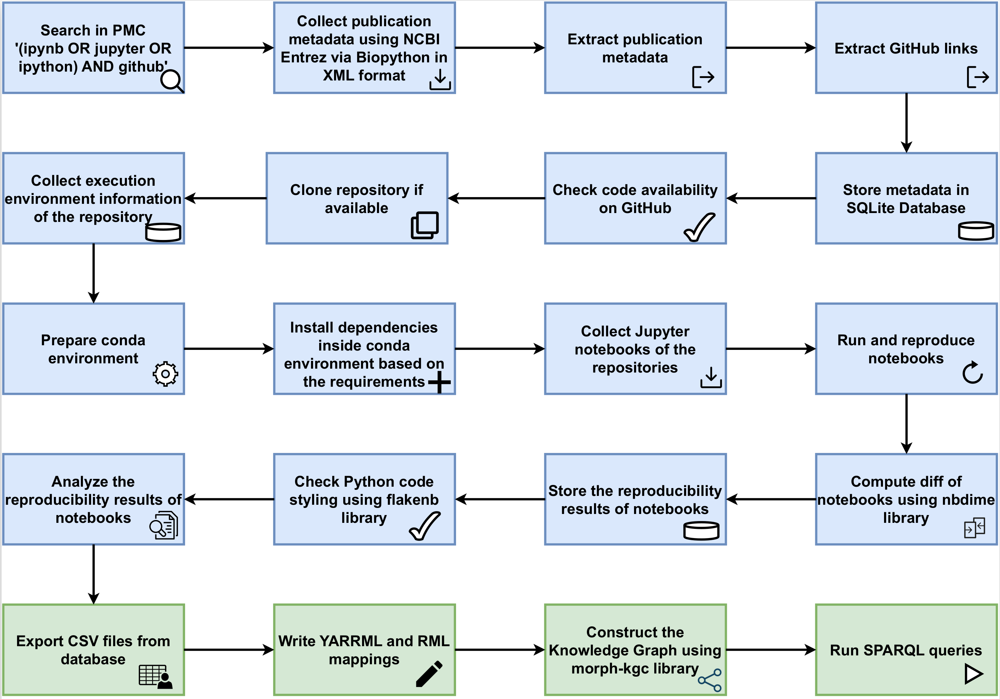

# FAIR Jupyter

FAIR Jupyter is a knowledge graph for semantic sharing and granular exploration of a computational notebook reproducibility dataset.

## FAIR Jupyter Knowledge Graph
FAIR Jupyter Knowledge Graph is based on the computational reproducibility dataset that we had previously shared in bulk (Computational reproducibility of Jupyter notebooks from biomedical publications, [10.1093/gigascience/giad113](https://doi.org/10.1093/gigascience/giad113)). This dataset can now be mobilized further through a knowledge graph that allows for much more granular exploration and interrogation. We took this dataset, converted it into semantic triples and loaded these into a triple store to create a knowledge graph – FAIR Jupyter – that we made accessible via a webservice. This enables granular data exploration and analysis through queries that can be tailored to specific use cases.


### Computational reproducibility of Jupyter notebooks from biomedical publications
In this dataset, we present the study of computational reproducibility of Jupyter notebooks from biomedical publications. Our focus lies in evaluating the extent of reproducibility of Jupyter notebooks derived from GitHub repositories linked to publications present in the biomedical literature repository, PubMed Central. We analyzed the reproducibility of Jupyter notebooks from GitHub repositories associated with publications indexed in the biomedical literature repository PubMed Central. The dataset includes the metadata information of the journals, publications, the Github repositories mentioned in the publications and the notebooks present in the Github repositories.

#### Resources used in computational reproducibility dataset creation
**Data**: Sheeba Samuel, & Daniel Mietchen. (2023). Dataset of a Study of Computational reproducibility of Jupyter notebooks from biomedical publications [Data set]. Zenodo. [https://doi.org/10.5281/zenodo.8226725](https://doi.org/10.5281/zenodo.8226725)

**Code**: [https://github.com/fusion-jena/computational-reproducibility-pmc](https://github.com/fusion-jena/computational-reproducibility-pmc)


### Permanent URL
[https://w3id.org/fairjupyter](https://w3id.org/fairjupyter)

### Knowledge Graph Browser
The Knowledge Graph browser for FAIR Jupyter is available at [https://reproduceme.uni-jena.de/fj/](https://reproduceme.uni-jena.de/fj/).

The code for the Knowledge Graph Browser is available in the folder [fjkg_visualization](fjkg_visualization).

Prequisites: SPARQLWrapper, flask, python 3.11.

The browser can be run on port 3031 using the command:

```gunicorn --bind 0.0.0.0:3031 app:app```


### Resources used in Knowledge Graph construction
**Code**: [https://github.com/fusion-jena/fairjupyter](https://github.com/fusion-jena/fairjupyter)

**Mapping**: [: https://github.com/fusion-jena/fairjupyter/tree/main/mapping](https://github.com/fusion-jena/fairjupyter/tree/main/mapping)

Below figure shows the workflow of our pipeline.


### FAIR Jupyter SPARQL Endpoint
The SPARQL Endpoint can be queried [here](https://reproduceme.uni-jena.de/#/dataset/fairjupyter/query)

### SPARQL Queries
Some SPARQL queries that can be queried over FAIR Jupyter KG can be accessed [here](https://github.com/fusion-jena/fairjupyter/tree/main/sparql_query).

These include SPARQL queries to the knowledge graph that reproduce materials from the
original manuscript describing the dataset, other queries over the FAIR Jupyter graph, and federated queries between the FAIR Jupyter KG and [Wikidata](https://query.wikidata.org/).

### FAIR Jupyter KG Schema
The ontologies used for constructing Knowledge Graphs are:
* [The REPRODUCE-ME ontology](https://w3id.org/reproduceme/)
* [The PROV-O ontology](https://www.w3.org/TR/prov-o/)
* [The P-Plan ontology](http://purl.org/net/p-plan#)
* [The PAV ontology](http://purl.org/pav/)
* [The FaBiO ontology](http://purl.org/spar/fabio)
* [The DOAP ontology](http://usefulinc.com/ns/doap#)

### FAIR Jupyter KG Data Used (CSV)
The data used for constructing FAIR Jupyter Knowledge Graph is available [here](https://github.com/fusion-jena/fairjupyter/tree/main/data)


## Publication

* Sheeba Samuel, Daniel Mietchen, FAIR Jupyter: a knowledge graph approach to semantic sharing and granular exploration of a computational notebook reproducibility dataset, Transactions on Graph Data and Knowledge, Vol. 2, Issue 2, Article No. 3, 2024.
(Preprint: arXiv:2404.12935, [https://doi.org/10.48550/arXiv.2404.12935](https://doi.org/10.48550/arXiv.2404.12935))
* Sheeba Samuel, Daniel Mietchen, Computational reproducibility of Jupyter notebooks from biomedical publications, GigaScience, Volume 13, 2024, giad113, [https://doi.org/10.1093/gigascience/giad113](https://doi.org/10.1093/gigascience/giad113)
